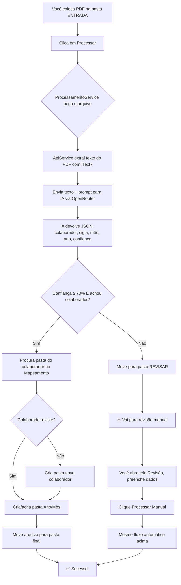

# 📚 Documentação Completa - Organizador de Documentos Financeiros

> **Guia didático para não desenvolvedores** — Entenda como o sistema funciona por dentro, sem precisar saber programar.

---

## 🎯 O que é este sistema?

Imagine que você recebe **dezenas de PDFs por mês** — vales transporte, alimentação, comissões, diárias, etc. Cada PDF precisa ir para a pasta correta do colaborador certo, organizado por **ano** e **mês**.

**Este sistema faz isso automaticamente:**
1. 📥 Você coloca os PDFs na pasta **ENTRADA**
2. 🤖 A Inteligência Artificial **lê** cada PDF e entende: *quem é o colaborador, que tipo de documento, qual mês/ano*
3. 📂 O sistema **move** o arquivo para a pasta correta automaticamente
4. ❓ Se a IA não tem certeza, o documento vai para **REVISAR** — você preenche manualmente

---

## 🏗️ Arquitetura Geral (Visão Simples)

```
┌─────────────────────────────────────────────────────────────────┐
│                     ORGANIZADOR DE DOCUMENTOS                    │
├─────────────────────────────────────────────────────────────────┤
│                                                                  │
│   ┌──────────────┐    ┌──────────────┐    ┌──────────────┐     │
│   │   INTERFACE  │    │   CÉREBRO    │    │  ARMAZENAMENTO│     │
│   │   (WPF UI)   │◄──►│  (Core/Serviços)│◄─►│  (Pastas/JSON)│     │
│   └──────────────┘    └──────────────┘    └──────────────┘     │
│         ▲                   ▲                   ▲                │
│         │                   │                   │                │
│   Botões, Listas,      IA + Regras         Config.json,       │
│   Formulários          de Negócio         Logs, Pastas         │
│                                                                  │
└─────────────────────────────────────────────────────────────────┘
```

### As 3 Camadas Principais

| Camada | O que faz | Analogia do Mundo Real |
|--------|-----------|------------------------|
| **Interface (UI)** | Tela que você vê e clica | O **painel de controle** de uma fábrica |
| **Core (Serviços)** | Regras, IA, organização | O **gerente da fábrica** que decide o que fazer |
| **Dados (Armazenamento)** | Guarda configurações e arquivos | O **arquivo morto** + **prateleiras** físicas |

---

## 📁 Estrutura de Pastas que o Sistema Cria

```
📂 Pasta Raiz (você escolhe onde fica)
│
├── 📂 ENTRADA              ← VOCÊ COLOCA OS PDFs AQUI
│   ├── documento1.pdf
│   └── documento2.pdf
│
├── 📂 REVISAR              ← PDFs que a IA NÃO ENTENDEU
│   └── documento_confuso.pdf
│
└── 📂 COLABORADORES        ← ARQUIVO FINAL ORGANIZADO
    │
    ├── 📂 JOAO_DA_SILVA    ← Pasta de um colaborador
    │   │
    │   ├── 📂 2025         ← Ano
    │   │   │
    │   │   ├── 📂 09 - Setembro    ← Mês
    │   │   │   ├── VT_JOAO_DA_SILVA_09-2025.pdf
    │   │   │   └── VA_JOAO_DA_SILVA_09-2025.pdf
    │   │   │
    │   │   └── 📂 10 - Outubro
    │   │       └── ...
    │   │
    │   └── 📂 2026
    │       └── ...
    │
    ├── 📂 MARIA_SANTOS
    │   └── ...
    │
    └── 📂 PEDRO_COSTA_LIMA
        └── ...
```

**Nomes dos arquivos seguem padrão:**
- `VT_JOAO_DA_SILVA_09-2025.pdf` → Vale Transporte, João da Silva, Set/2025
- `OS_PEDRO_COSTA_LIMA_OS-12345.pdf` → Vale por OS, número da OS

---

## 🤖 Como a Inteligência Artificial Funciona

### O que a IA recebe (texto extraído do PDF)
```
FUNCIONÁRIO: João da Silva
TIPO: Vale Transporte
COMPETÊNCIA: 09/2025
VALOR: R$ 250,00
DATA: 15/09/2025
```

### O que a IA devolve (JSON estruturado)
```json
{
  "colaborador": "João da Silva",
  "tipo_documento": "Vale Transporte",
  "sigla": "VT",
  "competencia": { "mes": 9, "ano": 2025 },
  "data": "15/09/2025",
  "numero_os": null,
  "confianca": 0.95
}
```

### Níveis de Confiança da IA

| Confiança | O que acontece |
|-----------|----------------|
| **≥ 70%** | Processa automaticamente ✅ |
| **< 70%** | Vai para **REVISAR** ⚠️ |
| **Não achou colaborador** | Vai para **REVISAR** ⚠️ |
| **Múltiplos colaboradores** | Vai para **REVISAR** ⚠️ |
| **Arquivo já existe no destino** | Vai para **REVISAR** ⚠️ |

---

## 🔧 As Principais Peças do Sistema (Serviços)

### 1. **ApiService** — Conversa com a IA
- Extrai texto do PDF (usa biblioteca iText7)
- Se PDF for escaneado/escrito à mão, **envia imagens diretamente para a IA** (Gemini lê handwriting)
- Se texto extraído for suficiente, envia texto normal (mais rápido)
- Automação: tenta iText7 → verifica qualidade → tenta OCR → envia imagens para IA
- Envia para OpenRouter (API que acessa vários modelos: Gemini, Claude, GPT)
- Recebe JSON de volta e transforma em objeto do C#

### 1.1 PDF Digitalizado / Escrita à Mão

Quando o PDF é **escaneado** ou tem **escrita à mão**, o iText7 não consegue extrair texto útil. Neste caso, o sistema:

1. Tenta extrair texto com iText7
2. Verifica se o texto contém datas/meses/anos reconhecíveis
3. Se não contiver → **converte o PDF em imagens** (Magick.NET, 200 DPI)
4. Envia até 8 páginas como **imagens base64** diretamente para a IA
5. O Gemini (modelo com visão) lê o handwriting e extrai os dados

**Por que imagens e não OCR?**
- Tesseract não foi feito para reconhecer caligrafia
- Modelos de IA com visão (Gemini, Claude, GPT-4V) são **muito melhores** em ler escrita à mão

### 1.2 OCR — Reconhecimento de PDFs Escaneados

Quando o iText7 não consegue extrair texto (PDF é imagem), o sistema automaticamente tenta OCR:

1. **Magick.NET** converte cada página do PDF em imagem (300 DPI)
2. **Tesseract** faz reconhecimento de texto na imagem (idioma: Português)
3. O texto extraído é enviado para a IA junto com o prompt

**Requisitos para OCR funcionar:**

| Item | Detalhe |
|------|---------|
| **Pacote Tesseract** | Incluído no projeto (v5.2.0) |
| **Magick.NET** | Incluído no projeto (v13.1.0) |
| **Linguagem Português** | Necessário arquivo `por.traineddata` na pasta `tessdata/` |
| **Ghostscript** | Necessário para Magick.NET renderizar PDFs |

**Para instalar o Tesseract com português:**
1. Baixe o instalador: https://github.com/UB-Mannheim/tesseract/wiki
2. Na instalação, selecione o idioma **Portuguese**
3. Ou baixe `por.traineddata`: https://github.com/tesseract-ocr/tessdata
4. Coloque na pasta `tessdata/` ao lado do `.exe`

**Para instalar Ghostscript (para Magick.NET renderizar PDFs):**
1. Baixe: https://www.ghostscript.com/releases/gsdnld.html
2. Instale e reinicie o computador

### 1.2 Como o fluxo funciona (texto + imagens)

```
PDF recebido
    │
    ▼
iText7 tenta extrair texto
    │
    ├── Texto com datas/meses? → Envia texto para IA (rápido)
    │
    └── Texto sem datas (digitalizado/à mão)?
         │
         ▼
    Magick.NET converte PDF → Imagens (200 DPI)
         │
         ▼
    Envia até 8 imagens como base64 para IA (Gemini lê handwriting)
         │
         ├── IA leu os dados? → Extrai JSON → Processa
         │
         └── IA não leu? → Vai para REVISAR
```

### 1.3 Texto vs Imagem — Qual caminho o sistema escolhe?

### 2. **ProcessamentoService** — O "Gerente" Principal
Orquestra tudo:
1. Chama a IA para ler o PDF
2. Verifica confiança
3. Procura o colaborador no mapeamento
4. Decide: **Sucesso** / **Revisar** / **Erro**
5. Move o arquivo para o lugar certo

### 3. **NormalizacaoService** — "Tradutor" de Nomes
Problema: "João da Silva" ≠ "JOAO_DA_SILVA" ≠ "joao silva"
Solução: Normaliza tudo para comparar:
- Remove acentos: `João` → `joao`
- Remove partículas: `da`, `de`, `do`, `das`, `dos`, `e`
- Resultado: todos viram `"joao silva"` → **match perfeito!**

### 4. **MapeamentoService** — Cadastro de Colaboradores
- Varre a pasta `COLABORADORES` e cria um "índice" em memória
- Sabe quem existe, onde fica a pasta de cada um
- Atualiza automaticamente quando cria colaborador novo

### 5. **FileService** — Operações de Arquivo
- Cria pastas ano/mês automaticamente
- Move arquivos com segurança (não sobrescreve sem querer)
- Gera nomes únicos se arquivo já existe (`_1`, `_2`, etc.)

### 6. **ConfiguracaoService** — Configurações do Usuário
- Salva em `%APPDATA%\OrganizadorDocumentos\config.json`
- **Cada computador tem seu próprio config** (API Key, pastas, modelo IA)
- Não vai para o Git (segurança)

### 7. **LogService** — Diário de Bordo
- Salva tudo em `%APPDATA%\OrganizadorDocumentos\logs\log_YYYY-MM-DD.txt`
- Níveis: **Info** (normal), **Aviso** (atenção), **Erro** (falhou)
- Essencial para debug: "por que esse PDF foi para revisar?"

---

## ⚙️ Configuração (O que você muda nas Configurações)

| Campo | Para que serve | Exemplo |
|-------|----------------|---------|
| **Pasta Raiz** | Onde ficam ENTRADA, REVISAR, COLABORADORES | `C:\MeusDocumentos\Financeiro` |
| **Pasta Colaboradores** | Nome da pasta dos colaboradores | `COLABORADORES` |
| **Pasta Revisar** | Nome da pasta de revisão | `REVISAR` |
| **Pasta Entrada** | Onde você deixa PDFs novos | `ENTRADA` |
| **API Key** | Chave do OpenRouter (obrigatório!) | `sk-or-v1-abc123...` |
| **Modelo IA** | Qual IA usar | `google/gemini-2.0-flash-001` |
| **Limiar Fuzzy** | Quão parecido o nome deve ser (0-1) | `0.85` (85%) |

---

## 🖥️ As Telas do Sistema (Menu Lateral)

### 📊 **Dashboard**
- Visão geral: quantos processados, em revisão, erros
- Atalhos rápidos

### ⚙️ **Processamento**
- Lista PDFs na pasta ENTRADA
- Botão **"Processar Tudo"**
- Barra de progresso
- Lista de resultados (sucesso/revisão/erro)

### 👁️ **Revisão** ⭐ *NOVO*
- Lista PDFs na pasta REVISAR
- **Clique em um arquivo** → aparece formulário lateral
- Preencha: Colaborador, Sigla, Mês/Ano, (opcional: Data, OS)
- Botão **"Processar"** → move para lugar certo automaticamente
- Cria colaborador novo se não existir!

### 👥 **Mapeamento**
- Mostra todos colaboradores encontrados nas pastas
- Quantos anos/meses cada um tem
- Botão "Atualizar" se você criou pasta manualmente

### ⚙️ **Configurações**
- Onde você define pastas, API Key, modelo IA
- Testa conexão com a API
- Salva automaticamente no seu usuário do Windows

---

## 🔐 Segurança e Privacidade

| Item | Como é protegido |
|------|------------------|
| **API Key** | Fica só no SEU computador (`%APPDATA%`), nunca no Git |
| **PDFs** | Ficam nas SUAS pastas locais, nunca enviados para nuvem |
| **Texto do PDF** | Enviado SÓ para a API da IA (OpenRouter), não fica salvo no app |
| **Logs** | Locais, só você vê |

---

## 🛠️ Tecnologias Usadas (Para Curiosidade)

| Camada | Tecnologia | Por que escolheu |
|--------|------------|------------------|
| **Interface** | WPF (.NET 10) | Nativo Windows, bonito, performático |
| **Arquitetura** | MVVM + Injeção de Dependência | Separa tela da lógica, testável |
| **PDF (texto)** | iText7 | Melhor biblioteca para ler PDF em .NET |
| **PDF (imagem/OCR)** | Magick.NET + Tesseract | Reconhecimento de PDFs escaneados |
| **IA** | OpenRouter API | Acesso a dezenas de modelos (Gemini, Claude, GPT) |
| **Fuzzy Match** | FuzzySharp | Compara nomes "parecidos" inteligentemente |
| **Logs** | Serilog | Profissional, estruturado, rotativo por dia |
| **Testes** | xUnit | Garante que regras não quebram |

---

## 🔄 Fluxo Completo: Do PDF à Pasta Final



---

## 🐛 Problemas Comuns e Soluções

| Problema | Causa Provável | Solução |
|----------|----------------|---------|
| **"API Key não configurada"** | Não colocou a chave nas Configurações | Vá em Configurações → cole sua chave OpenRouter |
| **"Erro na API: 401/403"** | API Key inválida ou sem créditos | Verifique no site do OpenRouter |
| **"Modelo não encontrado"** | Modelo errado no config | Use `google/gemini-2.0-flash-001` |
| **PDF vai pra Revisar sempre** | PDF digitalizado/escrita à mão | Sistema envia imagens para IA (Gemini). Verifique se a imagem está clara o suficiente |
| **PDF vai pra Revisar** | IA não leu os dados da imagem | Tente melhorar a qualidade do scan ou preencha manualmente na tela Revisão |
| **Colaborador não encontrado** | Nome no PDF diferente da pasta | Use Revisão manual; sistema aprende criando pasta |
| **Arquivo já existe** | Processou duas vezes o mesmo PDF | Sistema agora renomeia automático (`_1`, `_2`) |

---

## 📝 Como Contribuir / Estender

### Adicionar novo tipo de documento
1. Edite `SiglasDocumento.cs` → adicione sigla + descrição
2. Atualize prompt no `ApiService.cs` (SystemPrompt)
3. Teste!

### Mudar regra de organização
- Lógica de pastas: `FileService.cs` (métodos `BuscarPastaAno/Mes`)
- Nomes de arquivo: `ProcessamentoService.cs` → `GerarNomeArquivo()`

### Melhorar IA
- Prompt principal: `ApiService.cs` → `SystemPrompt` (linha 15)
- Adicione exemplos reais de PDFs seus no prompt

### Melhorar OCR
- Tesseract precisa do arquivo `por.traineddata` na pasta `tessdata/`
- Quality do OCR depende da resolução da imagem (300 DPI padrão)
- PDFs mais limpos = melhor extração por OCR
- Para PDF muito complexo, considere pré-processar com ferramentas de limpeza

---

## 📞 Suporte e Logs

**Sempre que der erro:**
1. Abra `%APPDATA%\OrganizadorDocumentos\logs\`
2. Procure o arquivo `log_YYYY-MM-DD.txt` de hoje
3. Procure por `[ERR]` — lá tem o erro exato e a linha do código

**Exemplo de log útil:**
```
2026-09-09 16:02:14.631 [INF] Processando: Avulso08092026171421.pdf
2026-09-09 16:02:14.631 [INF] Extraindo dados do PDF: Avulso08092026171421.pdf
2026-09-09 16:02:18.941 [WRN] Colaborador não identificado no documento
2026-09-09 16:02:18.941 [ERR] Erro durante processamento em lote
System.InvalidOperationException: Arquivo de destino já existe...
```

---

## 🎓 Resumo para Gestores / Usuários Finais

| Conceito | Explicação Simples |
|----------|-------------------|
| **O que faz** | Organiza PDFs financeiros em pastas por colaborador/ano/mês |
| **Como usa** | Coloca PDF na ENTRADA → clica Processar → pronto |
| **Quando falha** | Vai para REVISAR → você preenche 5 campos → clica Processar |
| **Onde ficam os arquivos** | Na pasta que VOCÊ escolheu (ex: `C:\Financeiro\`) |
| **Precisa internet?** | Sim, para a IA ler os PDFs (API OpenRouter) |
| **Custo** | Centavos por mês (modelo Gemini Flash é muito barato) |
| **Segurança** | Seus dados ficam no seu PC; só texto vai para IA |

---

## 📚 Glossário Técnico Simplificado

| Termo | Significado Simples |
|-------|-------------------|
| **API** | "Interface" — forma de programas conversarem entre si |
| **JSON** | Formato de texto organizado (chave: valor) que máquinas leem fácil |
| **MVVM** | Arquitetura: **M**odel (dados) + **V**iew (tela) + **VM** (liga os dois) |
| **Injeção de Dependência** | "Entregar as ferramentas prontas" em vez de cada um criar a sua |
| **Fuzzy Match** | Comparação "perdoa erros" — "João Silva" ≈ "JOAO_DA_SILVA" |
| **OpenRouter** | Site que dá acesso a TODAS as IAs (Gemini, Claude, GPT) com uma chave só |
| **iText7** | Biblioteca que sabe ler texto de dentro de PDF |
| **Serilog** | Biblioteca profissional de logs (diário do sistema) |
| **xUnit** | Ferramenta de testes automatizados |

---

*Documentação gerada em setembro/2026 — Versão 1.0*